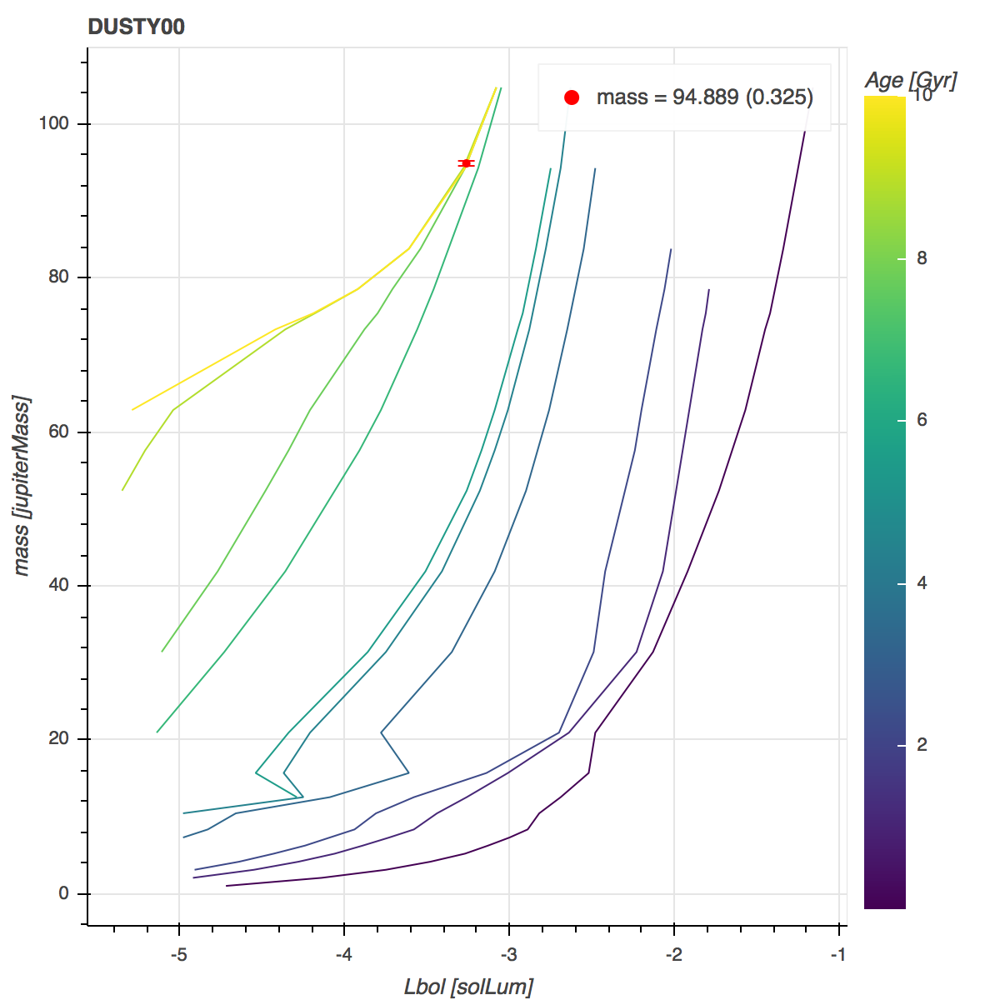
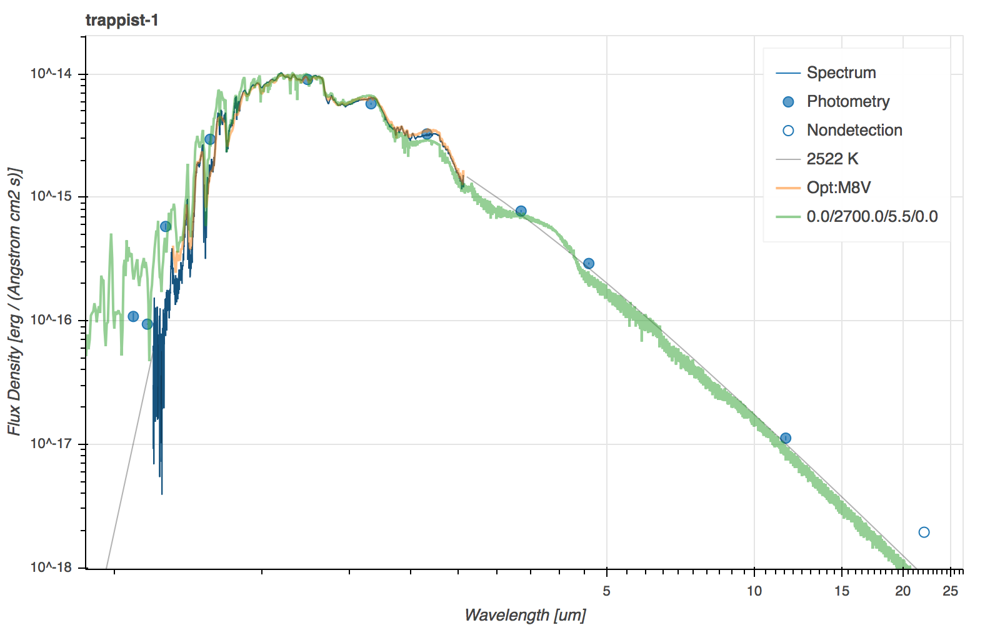
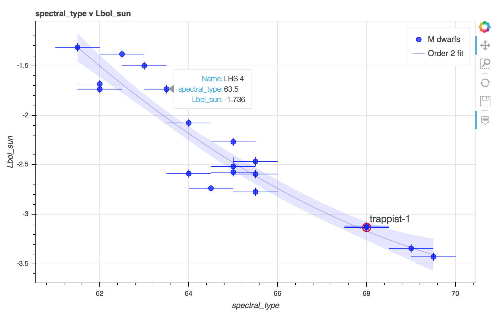

# `sedkit`
[](http://www.astropy.org)
[](https://github.com/hover2pi/sedkit/actions/workflows/ci.yml)
[](https://coveralls.io/github/hover2pi/sedkit?branch=master)
[](https://sedkit.readthedocs.io/en/latest/?badge=latest)
[](https://doi.org/10.5281/zenodo.14014658)


## Introduction

`sedkit` is a collection of pure Python modules for simple SED construction and analysis. Users can create individual SEDs or SED catalogs from spectra and/or photometry and calculate fundamental parameters (f<sub>bol</sub>, M<sub>bol</sub>, L<sub>bol</sub>, T<sub>eff</sub>, mass, log(g)) using the methods presented in [Filippazzo et al. (2015)](http://adsabs.harvard.edu/abs/2015ApJ...810..158F) and described in the documentation: https://sedkit.readthedocs.io/.


## Installation

Install via PyPI with

```
pip install sedkit
```

## Demo

An SED can be constructed by importing and initializing an `SED` object.

```python
from sedkit import SED
trap1 = SED(name='Trappist-1')
```

The `name` argument triggers a lookup in the Simbad database for meta, astrometric, and spectral type data. Interstellar reddening is calculated when possible.

Photometry can be added manually...

```python
trap1.add_photometry('Johnson.V', 18.798, 0.082, '2006AJ....132.1234C')
trap1.add_photometry('Cousins.R', 16.466, 0.065, '2006AJ....132.1234C')
trap1.add_photometry('Cousins.I', 14.024, 0.115, '2006AJ....132.1234C')
```

...and/or retrieved from Vizier catalogs with built-in methods.

```python
trap1.find_2MASS()
trap1.find_WISE()
```

Spectrum arrays or ASCII/FITS files can also be added to the SED data.

```python
from pkg_resources import resource_filename
spec_file = resource_filename('sedkit', 'data/Trappist-1_NIR.fits')
import astropy.units as u
trap1.add_spectrum_file(spec_file, wave_units=u.um, flux_units=u.erg/u.s/q.cm**2/u.AA)
```

Other data which may affect the calculated and inferred fundamantal parameters can be set at any time.

```python
trap1.spectral_type = 'M8', '2006AJ....132.1234C'
trap1.age = 7.6*u.Gyr, 2.2*u.Gyr, '2017ApJ...845..110B'
trap1.radius = 0.121*u.R_sun, 0.003*u.R_sun, '2021PSJ.....2....1A'
```

Results can be calculated at any time by checking the `results` property.

```python
trap1.results
```

<table>
 <thead>
  <tr>
   <th>param</th>
   <th>value</th>
   <th>unc</th>
   <th>units</th>
  </tr>
 </thead>
 <tr>
  <td>name</td>
  <td>Trappist-1</td>
  <td>--</td>
  <td>--</td>
 </tr>
 <tr>
  <td>ra</td>
  <td>346.6223683333333</td>
  <td>--</td>
  <td>--</td>
 </tr>
  <tr>
  <td>dec</td>
  <td>-5.0413974999999995</td>
  <td>--</td>
  <td>--</td>
 </tr>
 <tr>
  <td>age</td>
  <td>7.6</td>
  <td>2.2</td>
  <td>Gyr</td>
 </tr>
 <tr>
  <td>Lbol</td>
  <td>2.24e+30</td>
  <td>6.49e+28</td>
  <td>erg / s</td>
 </tr>
 <tr>
  <td>Lbol_sun</td>
  <td>-3.23</td>
  <td>0.013</td>
  <td>--</td>
 </tr>
 <tr>
  <td>Mbol</td>
  <td>12.836</td>
  <td>0.031</td>
  <td>--</td>
 </tr>
 <tr>
  <td>SpT</td>
  <td>M8V</td>
  <td>--</td>
  <td>--</td>
 </tr>
 <tr>
  <td>Teff</td>
  <td>2581</td>
  <td>37</td>
  <td>K</td>
 </tr>
 <tr>
  <td>fbol</td>
  <td>1.21e-10</td>
  <td>3.49e-12</td>
  <td>erg / (cm2 s)</td>
 </tr>
 <tr>
  <td>logg</td>
  <td>5.281466666666667</td>
  <td>0.005382456140353042</td>
  <td>--</td>
 </tr>
 <tr>
  <td>mass</td>
  <td>0.0921333333333333</td>
  <td>0.0013456140350877333</td>
  <td>solMass</td>
 </tr>
 <tr>
  <td>mbol</td>
  <td>13.308</td>
  <td>0.031</td>
  <td>--</td>
 </tr>
 <tr>
  <td>membership</td>
  <td>--</td>
  <td>--</td>
  <td>--</td>
 </tr>
 <tr>
  <td>parallax</td>
  <td>80.4512</td>
  <td>0.12110000103712082</td>
  <td>mas</td>
 </tr>
 <tr>
  <td>radius</td>
  <td>0.121</td>
  <td>0.003</td>
  <td>solRad</td>
 </tr>
 <tr>
  <td>reddening</td>
  <td>9.259104263037443e-05</td>
  <td>--</td>
  <td>--</td>
 </tr>
 <tr>
  <td>spectral_type</td>
  <td>68.0</td>
  <td>0.5</td>
  <td>--</td>
 </tr>
</table>

A variety of evolutionary model grids can be used to infer fundamental parameters,

```python
trap1.evo_model = 'DUSTY00'
trap1.infer_mass()
```



<!-- A variety of atmospheric model grids can be fit to the data with or without MCMC analysis,
```python
from sedkit import BTSettl
trap1.fit_modelgrid(BTSettl(), mcmc=True)
``` -->

Any arbitrary atlas of models (stored in `data\models\atmospheric`) can be used to fit the data with or without MCMC analysis. 

```python
from sedkit import SpexPrismLibrary
trap1.fit_modelgrid(SpexPrismLibrary(), mcmc=True)
```

Inspect the SED at any time with the interactive plotting method.

```python
trap1.plot(integral=True, best_fit=True)
```



References for all data can be accessed via the `refs` attribute.

Entire catalogs of `SED` objects can also be created and their properties can be arbitrarily compared and analyzed with the `sedkit.catalog.Catalog()` object.



Please read the [full documentation](https://sedkit.readthedocs.io/en/latest/) for details on this functionality and much more.

## Documentation and Notebooks

Full documentation is available: https://sedkit.readthedocs.io/.

The package also contains detailed Jupyter notebooks highlighting the core functionality of its primary classes, including

- [sedkit.spectrum.Spectrum](sedkit/notebooks/working_with_spectra.ipynb)
- [sedkit.sed.SED](sedkit/notebooks/create_sed.ipynb)
- [sedkit.catalog.Catalog](sedkit/notebooks/create_catalog.ipynb)

## Developer Instructions

If you plan to modify and/or contribute to the code, install an editable version of the package and the requirements for running the tests.

```
pip install sedkit -e .[test]
```